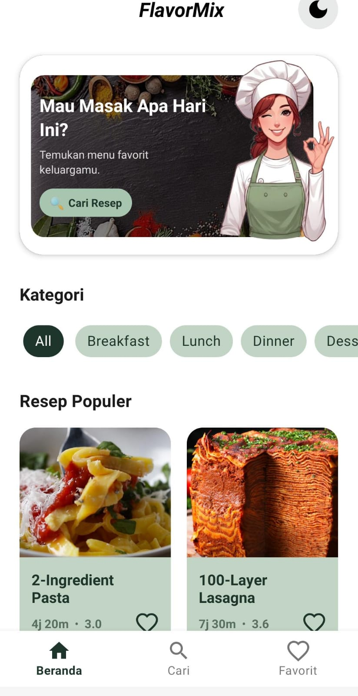
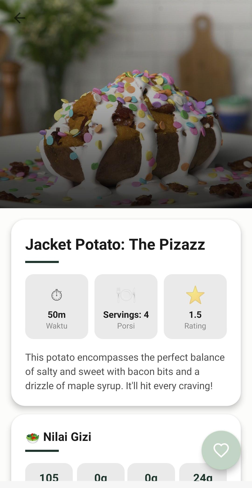
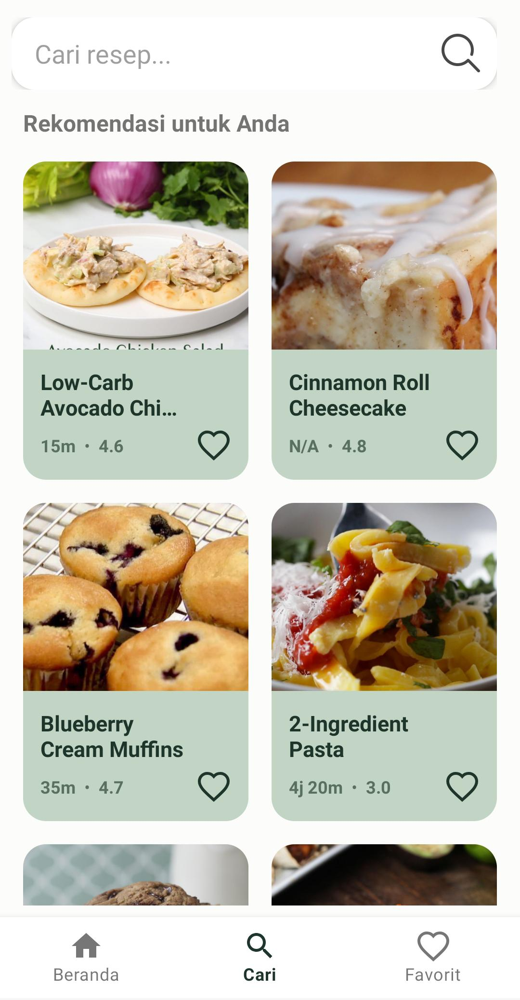
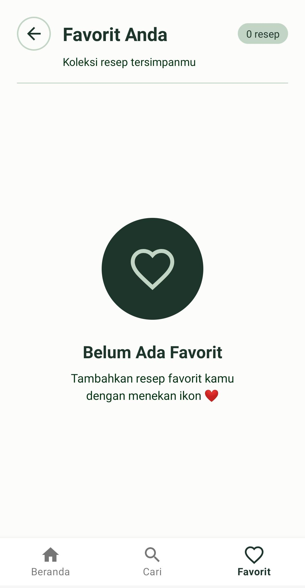

# 🍳 FlavorMix
Aplikasi resep masakan Android yang memungkinkan pengguna mencari, menjelajahi, dan menyimpan resep favorit menggunakan Tasty API.

---

## 📸 Tampilan Aplikasi

| Beranda | Detail | Pencarian | Favorit |
|--------|---------|-----------|--------|
|  |  |  |  |

---

## ✨ Fitur

- Pencarian resep berdasarkan judul dan kategori
- Filter resep cepat (< 20 menit) dan rating tertinggi
- Detail resep lengkap: bahan, cara membuat, dan nilai gizi
- Simpan resep ke favorit
- Mode offline — menampilkan resep dari cache lokal
- Tombol retry saat tidak ada koneksi internet
- Dark Mode dan Light Mode
- Tampilan modern dengan Material Design

---

## 🛠️ Spesifikasi Teknis

### Activity
- `SplashActivity` — Launcher utama aplikasi
- `MainActivity` — Activity utama dengan navigasi bawah
- `RecipeDetailActivity` — Halaman detail resep

### Fragment
- `HomeFragment` — Resep populer dan filter kategori
- `SearchFragment` — Pencarian dan filter resep
- `FavoriteListFragment` — Daftar resep favorit tersimpan

### Teknologi yang Digunakan

| Teknologi | Kegunaan |
|-----------|----------|
| Java | Bahasa pemrograman utama |
| Retrofit2 | Mengambil data dari Tasty API |
| SQLite | Menyimpan resep favorit dan cache lokal |
| RecyclerView | Menampilkan daftar resep |
| Navigation Component | Navigasi antar Fragment |
| Glide | Memuat gambar cover resep |
| ViewBinding | Akses view tanpa findViewById |
| SwipeRefreshLayout | Pull-to-refresh data |
| Material Components | Komponen UI modern |

---

## 🌐 API

**Tasty API** — [https://tasty.p.rapidapi.com](https://tasty.p.rapidapi.com) 

---

## 📂 Struktur Project

```
FlavorMix/
├── app/src/main/
│   ├── java/com/example/flavormix/
│   │   ├── adapter/
│   │   │   ├── RecipeAdapter.java
│   │   │   └── RecentSearchAdapter.java
│   │   ├── api/
│   │   │   ├── RetrofitClient.java
│   │   │   └── ApiService.java
│   │   ├── database/
│   │   │   └── RecipeDbHelper.java
│   │   ├── fragment/
│   │   │   ├── HomeFragment.java
│   │   │   ├── SearchFragment.java
│   │   │   └── FavoriteListFragment.java
│   │   ├── model/
│   │   │   ├── Recipe.java
│   │   │   └── RecipeListResponse.java
│   │   ├── utils/
│   │   │   ├── NetworkUtils.java
│   │   │   └── PreferencesHelper.java
│   │   ├── MainActivity.java
│   │   ├── RecipeDetailActivity.java
│   │   ├── SplashActivity.java
│   │   └── FavoriteActivity.java
│   └── res/
│       ├── layout/
│       │   ├── activity_main.xml
│       │   ├── activity_splash.xml
│       │   ├── activity_recipe_detail.xml
│       │   ├── activity_favorite.xml
│       │   ├── fragment_home.xml
│       │   ├── fragment_search.xml
│       │   ├── fragment_favorite.xml
│       │   └── item_recipe.xml
│       ├── drawable/
│       ├── drawable-night/
│       ├── menu/
│       │   └── bottom_nav_menu.xml
│       ├── navigation/
│       │   └── nav_graph.xml
│       ├── values/
│       │   ├── colors.xml
│       │   ├── strings.xml
│       │   └── themes.xml
│       └── values-night/
│           ├── colors.xml
│           └── themes.xml
└── README.md
```

---

## ⚙️ Cara Install

### Cara 1 — Via APK (Mudah)

1. Buka halaman **Releases** di GitHub 
2. Klik file `app-debug.apk` → otomatis download
3. Pindahkan file APK ke HP Android
4. Aktifkan **Install from unknown sources**: Pengaturan → Keamanan → Install from unknown sources → **ON**
5. Buka file `app-debug.apk` di HP → klik **Install**
6. Buka aplikasi **FlavorMix**

### Cara 2 — Via Source Code (Build Sendiri)

**Prasyarat**
- Android Studio Hedgehog atau lebih baru
- Java JDK 11 atau lebih tinggi
- Android SDK minimum API 21
- Koneksi internet

**Langkah-langkah**

1. Download source code dari GitHub:
   ```bash
   git clone https://github.com/angelcatrina/FlavorMixApp.git
   ```
   Atau klik tombol **Code → Download ZIP** lalu extract ke folder komputer kamu.

2. Buka project di Android Studio:
   - Buka Android Studio → klik **Open**
   - Pilih folder `FlavorMix` hasil clone/extract
   - Tunggu Gradle sync selesai

3. Tambahkan API Key di `RetrofitClient.java`:
   ```java
   .addHeader("X-RapidAPI-Key", "MASUKKAN_API_KEY_KAMU_DI_SINI")
   ```

4. Jalankan aplikasi:
   - Hubungkan HP Android ke komputer via USB
   - Aktifkan **Developer Mode**: Pengaturan → Tentang Ponsel → Ketuk Nomor Build 7x
   - Aktifkan **USB Debugging**: Pengaturan → Opsi Pengembang → USB Debugging → **ON**
   - Klik tombol **Run** di Android Studio → pilih HP kamu → klik **OK**

   Atau build APK sendiri:
   ```
   Build → Build Bundle(s)/APK(s) → Build APK(s)
   ```
   File APK tersimpan di: `app/build/outputs/apk/debug/app-debug.apk`

---

## 🚀 Cara Penggunaan

1. **Buka aplikasi** — Splash screen muncul sebentar lalu masuk ke beranda
2. **Jelajahi resep** — Beranda menampilkan resep populer berdasarkan kategori (All, Breakfast, Lunch, Dinner, Dessert)
3. **Cari resep** — Ketik nama resep di kolom pencarian lalu tekan Search
4. **Filter hasil** — Gunakan filter **Resep < 20 menit** atau **Rating Tertinggi**
5. **Lihat detail** — Klik resep untuk melihat bahan, cara membuat, dan nilai gizi
6. **Simpan favorit** — Tekan ikon ❤️ untuk menyimpan resep ke favorit
7. **Lihat favorit** — Buka tab Favorit untuk melihat semua resep tersimpan
8. **Mode offline** — Resep favorit tetap tampil meskipun tidak ada internet

---

## 👤 Developer

| | |
|---|---|
| **Nama** | Angel Catrina Sobbu |
| **Tema** | Food & Drink |
| **API** | Tasty API (RapidAPI) |
| **Tahun** | 2026 |

---

## 📄 Lisensi

Project ini dibuat untuk keperluan **Tugas Final Lab Mobile 2026**

