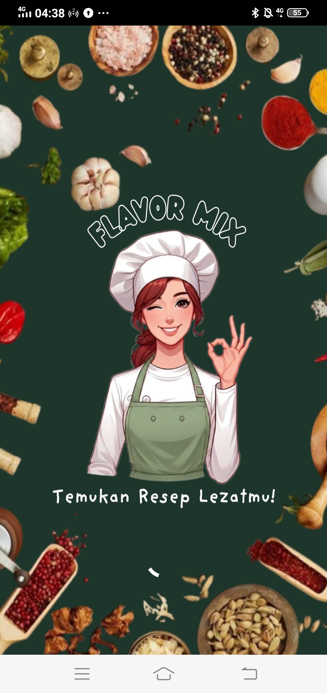
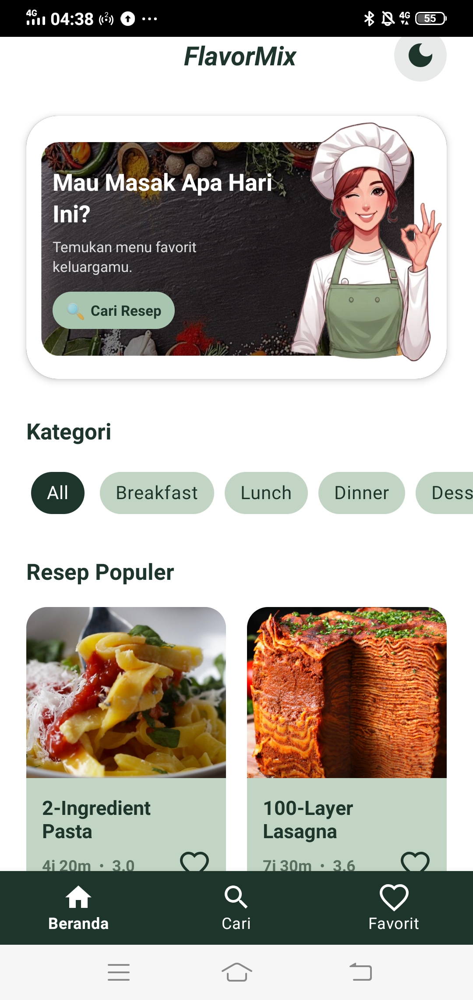
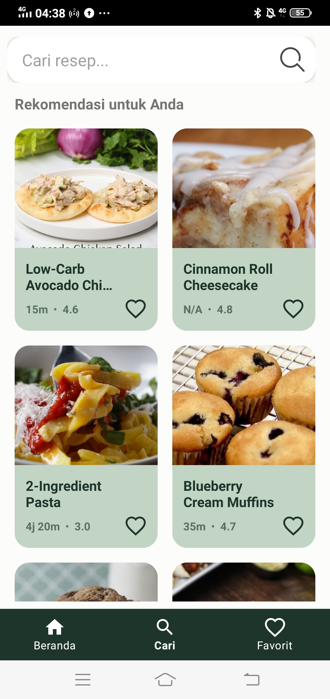
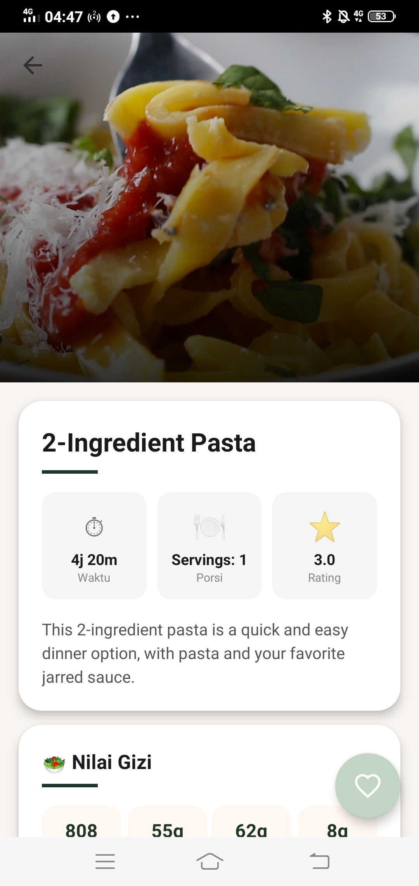
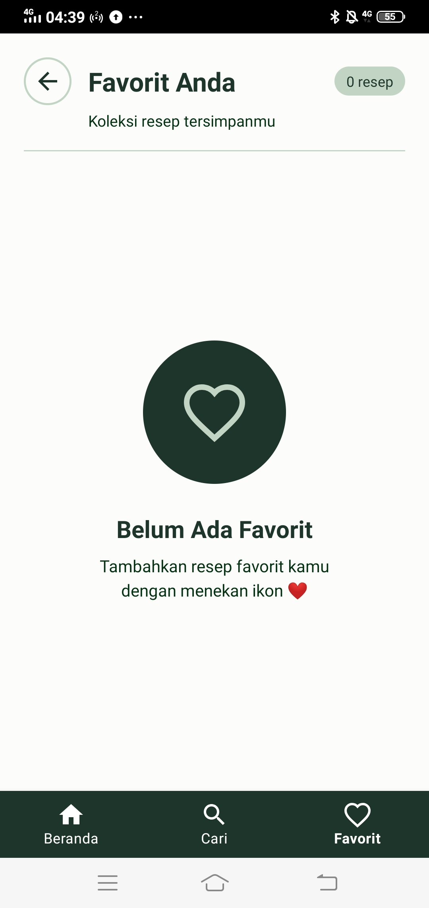

# 🍳 FlavorMix

<p align="center">
  
</p>

<p align="center">
  <strong>Temukan dan simpan resep favoritmu dengan mudah</strong>
</p>

<p align="center">
  
  
  
  
</p>

---

## 📱 Tentang Aplikasi

**FlavorMix** adalah aplikasi resep masakan Android yang memungkinkan pengguna untuk mencari, menjelajahi, dan menyimpan resep favorit mereka. Aplikasi ini menggunakan API Tasty untuk menampilkan ribuan resep lezat dari seluruh dunia.

---

## ✨ Fitur Utama

- 🏠 **Beranda** — Tampilan resep populer dengan kategori (All, Breakfast, Lunch, Dinner, Dessert)
- 🔍 **Pencarian** — Cari resep dengan filter waktu (< 20 menit) dan rating tertinggi
- ❤️ **Favorit** — Simpan resep favorit secara lokal menggunakan SQLite
- 🌙 **Dark Mode** — Mendukung tampilan gelap dan terang
- 📶 **Offline Mode** — Data tersimpan di cache saat tidak ada koneksi internet
- 📋 **Detail Resep** — Informasi lengkap: bahan, cara membuat, nilai gizi, rating

---

## 📸 Screenshot

| Splash | Beranda | Pencarian | Detail Resep | Favorit |
|--------|---------|-----------|--------------|---------|
|  |  |  |  |  |

> Tambahkan folder `screenshots/` di root project dan isi dengan screenshot aplikasi kamu.

---

## 🛠️ Teknologi yang Digunakan

| Teknologi | Kegunaan |
|-----------|----------|
| **Java** | Bahasa pemrograman utama |
| **Retrofit2** | HTTP client untuk konsumsi API |
| **Glide** | Loading dan caching gambar |
| **SQLite** | Penyimpanan data favorit & cache lokal |
| **ViewBinding** | Akses view tanpa findViewById |
| **Material Components** | Komponen UI modern |
| **Navigation Component** | Navigasi antar fragment |
| **RecyclerView** | Menampilkan daftar resep |
| **SwipeRefreshLayout** | Pull-to-refresh data |

---

## 🌐 API

Aplikasi ini menggunakan **Tasty API** dari RapidAPI.

```
Base URL: https://tasty.p.rapidapi.com/
Endpoint: /recipes/list
Endpoint: /recipes/detail
```

> Daftarkan akun di [RapidAPI](https://rapidapi.com) untuk mendapatkan API Key.

---

## 🚀 Cara Menjalankan

### Prasyarat
- Android Studio **Hedgehog** atau lebih baru
- JDK 11 atau lebih baru
- Android SDK minimum API 21

### Langkah Instalasi

1. **Clone repository ini**
   ```bash
   git clone https://github.com/username/FlavorMix.git
   ```

2. **Buka di Android Studio**
   ```
   File → Open → pilih folder FlavorMix
   ```

3. **Tambahkan API Key**

   Buka file `app/src/main/java/com/example/flavormix/api/RetrofitClient.java` dan masukkan API Key kamu:
   ```java
   .addHeader("X-RapidAPI-Key", "MASUKKAN_API_KEY_KAMU_DI_SINI")
   ```

4. **Sync Gradle**
   ```
   File → Sync Project with Gradle Files
   ```

5. **Jalankan aplikasi**
   ```
   Run → Run 'app' atau tekan Shift+F10
   ```

---

## 📁 Struktur Project

```
FlavorMix/
├── app/src/main/
│   ├── java/com/example/flavormix/
│   │   ├── adapter/          # RecipeAdapter, RecentSearchAdapter
│   │   ├── api/              # RetrofitClient, ApiService
│   │   ├── database/         # RecipeDbHelper (SQLite)
│   │   ├── fragment/         # HomeFragment, SearchFragment, FavoriteListFragment
│   │   ├── model/            # Recipe, RecipeListResponse
│   │   ├── utils/            # NetworkUtils, PreferencesHelper
│   │   ├── MainActivity.java
│   │   ├── RecipeDetailActivity.java
│   │   ├── SplashActivity.java
│   │   └── FavoriteActivity.java
│   └── res/
│       ├── layout/           # XML layout files
│       ├── drawable/         # Gambar dan shape drawable
│       ├── values/           # Colors, strings, themes (light)
│       └── values-night/     # Colors, themes (dark mode)
└── README.md
```

---

## 👤 Developer

**Nama:** [Nama Kamu]
**Email:** [email@kamu.com]
**GitHub:** [@username](https://github.com/username)

---

## 📄 Lisensi

```
Copyright © 2024 FlavorMix

Licensed under the MIT License.
```

---

<p align="center">Dibuat dengan ❤️ menggunakan Android Studio</p>
